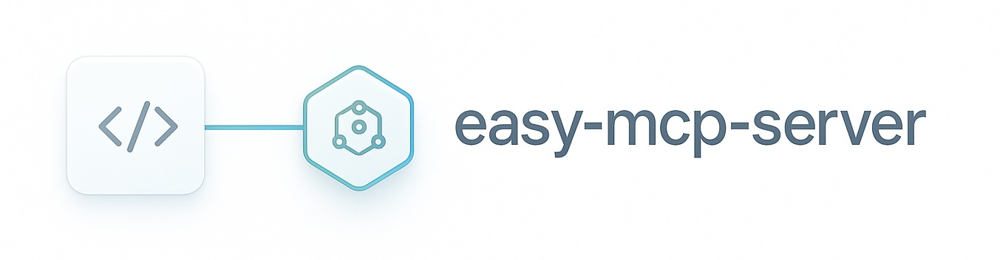
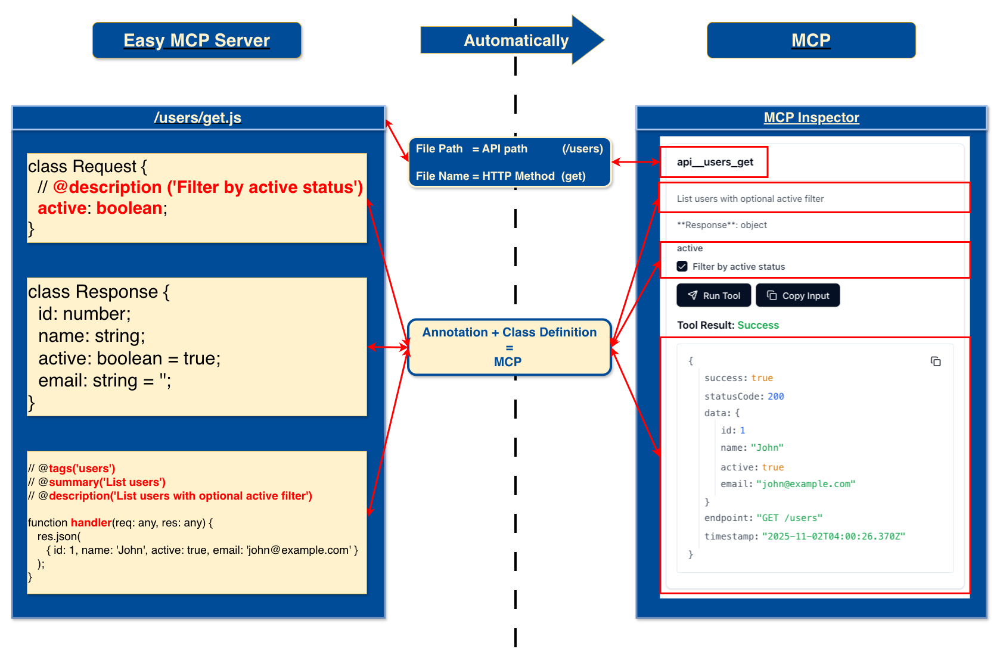
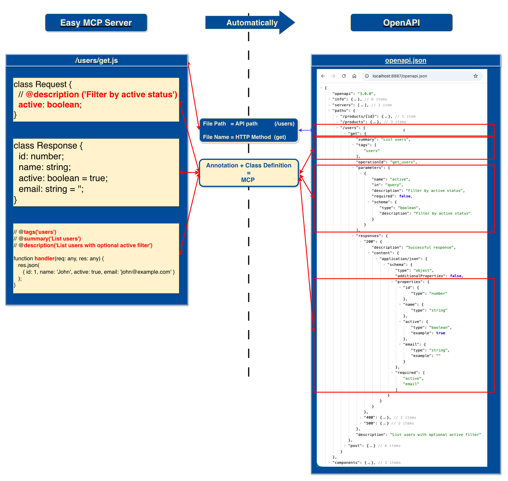
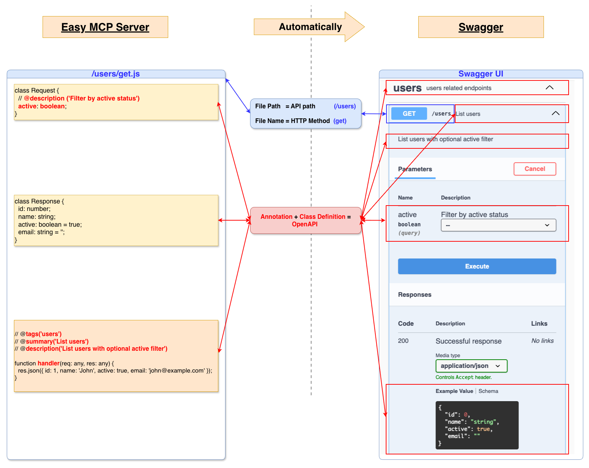

# easy-mcp-server

<p align="center">
  
</p>

<h2>The easiest way to build MCP</h2>

[](https://www.npmjs.com/package/easy-mcp-server)
[](https://opensource.org/licenses/MIT)
[](https://modelcontextprotocol.io)
[](https://modelcontextprotocol.io)
[](https://www.openapis.org/)
[](https://swagger.io/)

**Write code once → Get REST API + OpenAPI + Swagger + MCP tools + n8n nodes automatically**

---

## What We Are Providing

| Feature | Description | Benefit |
|---------|-------------|---------|
| **MCP Server** 🤖 | Your API endpoints automatically become MCP tools for AI agents | Connect your APIs to AI models instantly |
| **n8n Nodes** 🔗 | Auto-generate n8n workflow nodes from your APIs | Integrate with n8n automation platform |
| **REST API** | Automatic REST endpoints from file structure | No routing configuration needed |
| **OpenAPI Spec** | Auto-generated OpenAPI 3.0 specification | Standard API documentation format |
| **Swagger UI** | Interactive API documentation | Test APIs directly in browser |
| **MCP Bridge** | Built-in bridge to external MCP servers | Access Chrome DevTools, iTerm, and more |
| **Hot Reload** | Instant file changes without restart | Faster development workflow |
| **Auto Schema** | Request/Response classes → JSON schemas | Type-safe API definitions |
| **Zero Config** | Convention over configuration | Start coding immediately |

---

## 🚀 Quick Start

### 1. Setup

```bash
npx easy-mcp-server init my-api-project
cd my-api-project
npm install
./start.sh
```

**That's it!** Your services are running:

| Service | URL |
|---------|-----|
| **MCP Server** 🤖 | http://localhost:8888 |
| **REST API** | http://localhost:8887 |
| **Swagger UI** | http://localhost:8887/docs |
| **OpenAPI Spec** | http://localhost:8887/openapi.json |

### 2. Write Your First Endpoint

**POST Endpoint Example:**
```javascript
// api/users/post.js
class Request {
  // @description('User name')
  name: string;
  
  // @description('User email')
  email: string;
}

class Response {
  success: boolean;
  id: string;
  name: string;
  email: string;
}

// @description('Create a new user')
// @summary('Create user')
// @tags('users')
function handler(req: any, res: any) {
  const { name, email } = req.body;
  res.json({ 
    success: true, 
    id: '123', 
    name, 
    email 
  });
}

module.exports = handler;
```

**What you get automatically:**
- ✅ MCP tool for AI agents
- ✅ n8n workflow node (on demand)
- ✅ REST endpoint: `POST /users`
- ✅ Swagger UI documentation
- ✅ OpenAPI specification
- ✅ Hot reload (changes apply instantly)

---

## 🔗 n8n Node Generation

Transform your APIs into n8n workflow nodes automatically. Your API endpoints become drag-and-drop nodes in n8n's visual workflow builder.

### Quick Start

```bash
# Generate n8n node package from your APIs
npm run n8n:generate

# Preview node definition without generating files
npm run n8n:preview
```

### Custom Generation

```bash
# Generate with custom settings
node src/n8n/n8n-server.js \
  --node-name "MyAPI" \
  --display-name "My API" \
  --base-url "https://api.example.com" \
  --output-dir "./my-n8n-nodes" \
  --require-auth
```

### CLI Options

| Option | Default | Description |
|--------|---------|-------------|
| `--api-path <path>` | `./api` | Path to your API directory |
| `--output-dir <path>` | `./n8n-nodes-output` | Where to generate the node package |
| `--node-name <name>` | `CustomAPI` | Internal node name (used in code) |
| `--display-name <name>` | `Custom API` | Display name shown in n8n UI |
| `--base-url <url>` | `http://localhost:3000` | Your API base URL |
| `--author <name>` | - | Package author name |
| `--version <version>` | `1.0.0` | Package version |
| `--require-auth` | `false` | Enable API authentication |
| `--preview` | `false` | Preview without generating files |

### What Gets Generated

The generator creates a complete n8n community node package:

```
n8n-nodes-output/
├── nodes/
│   └── YourAPI.node.ts       # Main node implementation
├── credentials/
│   └── YourAPI.credentials.ts # (if --require-auth is used)
├── package.json               # npm package configuration
├── tsconfig.json              # TypeScript configuration
├── gulpfile.js                # Build scripts
├── .gitignore                 # Git ignore rules
└── README.md                  # Documentation
```

### Generated Features

| Feature | Description |
|---------|-------------|
| **Resource Organization** | APIs grouped by resource (users, products, etc.) |
| **Operation Mapping** | GET → "Get all/Get one", POST → "Create", PUT/PATCH → "Update", DELETE → "Delete" |
| **Field Validation** | Automatic validation based on your API schemas |
| **Request Routing** | Path, query, and body parameters properly routed |
| **Type Conversion** | JSON Schema types mapped to n8n field types |
| **Credentials Support** | Optional API key/token authentication |

### Example: From API to n8n Node

**Your API Code:**
```javascript
// api/users/get.js
class Request {
  // @description('Maximum number of users to return')
  limit: number;
}

class Response {
  users: Array<{ id: string; name: string; email: string }>;
}

// @description('Get all users from the system')
// @summary('List users')
// @tags('users')
function handler(req, res) {
  const { limit } = req.query;
  res.json({ users: [] });
}

module.exports = handler;
```

**Generated n8n Node:**
- Resource: "Users"
- Operation: "Get all"
- Field: "Limit" (number input with validation)
- Routing: Automatically configured to call `GET /users?limit=X`

### Install in n8n

#### Option 1: Local Installation
```bash
cd n8n-nodes-output
npm install
npm run build

# Copy to your n8n custom nodes directory
cp -r dist/* ~/.n8n/custom/
```

#### Option 2: Publish to npm
```bash
cd n8n-nodes-output
npm install
npm run build

# Publish to npm registry
npm publish

# Then install in n8n via Community Nodes
# Settings → Community Nodes → Install: n8n-nodes-yourapi
```

#### Option 3: Link for Development
```bash
cd n8n-nodes-output
npm install
npm run build
npm link

# In your n8n directory
npm link n8n-nodes-yourapi
```

### Real-World Example

```bash
# Generate node for a production API
node src/n8n/n8n-server.js \
  --node-name "ShopifyAPI" \
  --display-name "Shopify Store API" \
  --base-url "https://mystore.myshopify.com/api/2024-01" \
  --author "Your Company" \
  --require-auth \
  --output-dir "./n8n-nodes-shopify"

# Result: Professional n8n node package ready for:
# - Internal company use
# - Publishing to npm
# - Sharing with n8n community
```

### Integration Workflow

```
1. Write your API → Use easy-mcp-server conventions
2. Generate n8n node → npm run n8n:generate
3. Build & install → npm install && npm run build
4. Use in workflows → Drag & drop in n8n
5. Update API → Regenerate node automatically
```

### Benefits

- **Zero Manual Work** - No hand-coding n8n nodes
- **Always in Sync** - Regenerate when APIs change
- **Type Safety** - TypeScript with full n8n interfaces
- **Best Practices** - Follows n8n community node standards
- **Production Ready** - Complete package with all metadata

---

## ✨ How It Works

### File Structure → API Endpoints

| File Path | HTTP Method | API Endpoint |
|-----------|-------------|--------------|
| `api/users/get.js` | GET | `/users` |
| `api/users/post.js` | POST | `/users` |
| `api/products/[id]/get.js` | GET | `/products/:id` |

### Code Annotations → Documentation

| Annotation | Purpose | Example |
|------------|---------|---------|
| `@description` | API description | `@description('Get user information')` |
| `@summary` | Brief summary | `@summary('Get user')` |
| `@tags` | Categorization | `@tags('users,data-access')` |
| `Request` class | Request schema | Auto-generated from class properties |
| `Response` class | Response schema | Auto-generated from class properties |

**Result:**
- 🤖 **MCP Server** - AI agents can use your endpoints as tools
- 🔗 **n8n Nodes** - Workflow automation nodes (generated on demand)
- 🚀 **REST API** - Standard HTTP endpoints
- 📚 **Swagger UI** - Interactive documentation
- 📄 **OpenAPI** - Machine-readable specification

---

## 🔌 MCP Bridge (Built-in)

**Connect to external MCP servers without configuration.**

| Bridge Server | Capabilities | Use Cases |
|---------------|--------------|-----------|
| **Chrome MCP** 🌐 | Browser automation, web operations | Navigate pages, click elements, take screenshots, test web apps |
| **iTerm MCP** 💻 | Terminal & system operations | Execute commands, system diagnostics, server operations |

**Access:** Your AI agents use these tools via MCP server at `http://localhost:8888`

**Configuration:** Managed via `mcp-bridge.json` (included by default)

> 📖 **For detailed bridge configuration and advanced setup, see [Development Guide - MCP Bridge](docs/DEVELOPMENT.md#mcp-bridge-configuration)**

---

## 📊 Visual Overview



*API endpoints automatically become MCP tools*


*Code automatically generates OpenAPI specification*


*Interactive Swagger UI generated automatically*

---

## 🎯 Core Concept

**Write Once, Get Everything:**

| Your Code | → | Generated Outputs |
|-----------|---|-------------------|
| `api/users/get.js` | → | REST endpoint: `GET /users` |
| | → | MCP tool: `api_users_get` |
| | → | n8n node: "Users → Get all" |
| | → | OpenAPI spec entry |
| | → | Swagger UI documentation |
| `@description` annotation | → | Descriptions in all outputs |
| `Request` class | → | Input schemas everywhere |
| `Response` class | → | Output schemas everywhere |

**One codebase = Multiple integrations automatically**

---

## 💡 Why easy-mcp-server?

| Traditional Approach | With easy-mcp-server |
|---------------------|---------------------|
| Write Express routes manually | File-based routing (zero config) |
| Write OpenAPI spec by hand | Auto-generated from code |
| Build MCP tools separately | Automatic MCP integration |
| Hand-code n8n nodes (200+ lines) | Generate with one command |
| Maintain 4+ codebases in sync | Single codebase for everything |
| Update docs manually | Docs update automatically |
| Hours of setup per integration | 30 seconds to full stack |

**Result:** 10x faster development, zero maintenance overhead, always in sync.

---

## 🎪 Use Cases

### For AI Developers
Build AI-powered applications with MCP tools:
- Connect your APIs to Claude, GPT, or any MCP-compatible AI
- Enable AI agents to interact with your systems
- Auto-generate tool definitions from your existing APIs

### For Automation Engineers
Create workflow automation nodes:
- Generate n8n nodes from your internal APIs
- Build custom integrations for n8n workflows
- Share API integrations across your organization

### For API Developers
Rapid API development with auto-documentation:
- Build REST APIs with zero boilerplate
- Get Swagger UI and OpenAPI specs automatically
- Focus on business logic, not infrastructure

### For Integration Teams
Single source of truth for multiple platforms:
- Maintain one codebase for all integrations
- Generate client libraries automatically
- Ensure consistency across all platforms

---

## 🔧 Configuration

### Environment Variables

All environment variables are prefixed with `EASY_MCP_SERVER_`:

| Variable | Default | Description |
|----------|---------|-------------|
| `EASY_MCP_SERVER_PORT` | 8887 | REST API port |
| `EASY_MCP_SERVER_MCP_PORT` | 8888 | MCP server port |
| `EASY_MCP_SERVER_LOG_LEVEL` | info | Logging level (debug, info, warn, error) |

**Example:**
```bash
EASY_MCP_SERVER_PORT=8887
EASY_MCP_SERVER_MCP_PORT=8888
EASY_MCP_SERVER_LOG_LEVEL=info
```

> 📖 **For complete configuration options, see [Development Guide - Configuration](docs/DEVELOPMENT.md#configuration-management)**

---

## 📚 Documentation

| Resource | Description | Link |
|----------|-------------|------|
| **Development Guide** | Complete technical documentation, architecture, API reference | [docs/DEVELOPMENT.md](docs/DEVELOPMENT.md) |
| **Example Project** | Working example with sample endpoints | `example-project/` directory |
| **Swagger UI** | Interactive API documentation | http://localhost:8887/docs |
| **OpenAPI Spec** | Machine-readable API specification | http://localhost:8887/openapi.json |

---

## 💼 Business & Support

### Services We Provide

| Service | Description |
|---------|-------------|
| **AI Quick Onboarding** 🚀 | Fast-track setup and integration of AI/MCP solutions for your business |
| **AI Consultant** 💡 | Expert guidance on AI integration, MCP architecture, and best practices |

### Contact Us

| Inquiry Type | Contact |
|--------------|---------|
| **Business Discussion** | info@easynet.world |
| **Customer Support** | info@easynet.world |
| **AI Consulting** | info@easynet.world |

---

## 👤 Maintainer

| Role | Name | Contact |
|------|------|---------|
| **Code Owner** | Boqiang Liang | boqiang.liang@easynet.world |

---

## 🤝 Contributing

| Step | Action |
|------|--------|
| 1. Fork | Fork the repository |
| 2. Branch | Create feature branch |
| 3. Commit | Commit your changes |
| 4. Push | Push to branch |
| 5. PR | Open Pull Request |

> 📖 **For detailed contribution guidelines, see [Development Guide - Contributing](docs/DEVELOPMENT.md#contributing)**

---

## 📄 License

MIT License - see [package.json](package.json) for license details.

---

## 🔍 Need More Details?

| Topic | Documentation |
|-------|---------------|
| **n8n Node Generation** | See [n8n Node Generation](#-n8n-node-generation) section above |
| **MCP Tools** | See [MCP Bridge](#-mcp-bridge-built-in) section above |
| Architecture & Design | [Development Guide - Architecture](docs/DEVELOPMENT.md#architecture-overview) |
| JSDoc Annotations | [Development Guide - Annotations](docs/DEVELOPMENT.md#jsdoc-annotations) |
| MCP Protocol Details | [Development Guide - MCP Module](docs/DEVELOPMENT.md#mcp-module-architecture) |
| OpenAPI Generation | [Development Guide - OpenAPI](docs/DEVELOPMENT.md#openapi-generation) |
| Testing | [Development Guide - Testing](docs/DEVELOPMENT.md#testing) |
| Troubleshooting | [Development Guide - Troubleshooting](docs/DEVELOPMENT.md#troubleshooting) |
