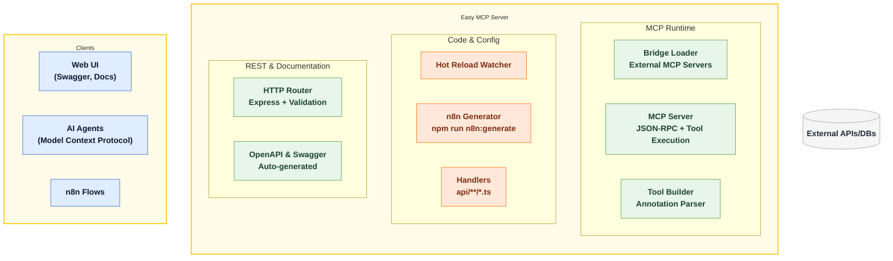
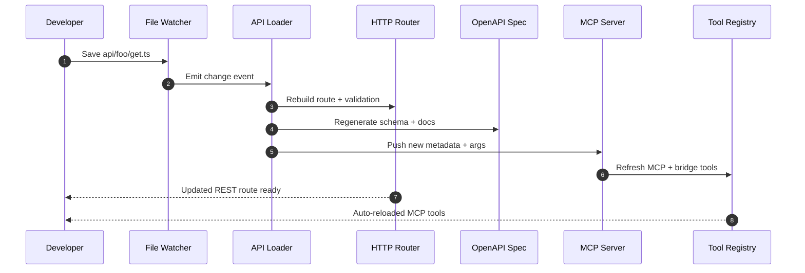
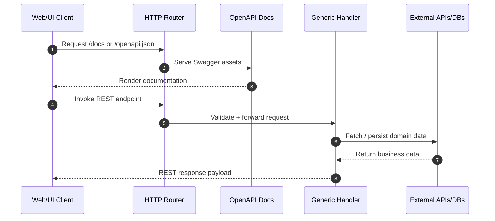
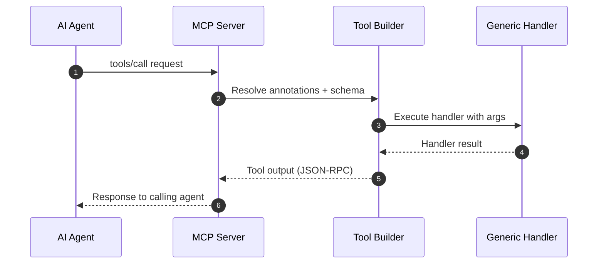
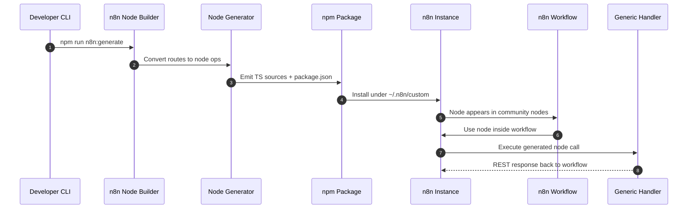

<p align="center">
  
</p>

[](https://www.npmjs.com/package/easy-mcp-server)
[](https://opensource.org/licenses/MIT)
[](https://modelcontextprotocol.io)
[](https://modelcontextprotocol.io)

**Write a handler once, get REST endpoints, Swagger/OpenAPI docs, MCP tools, and n8n nodes automatically.**

---

## 1. What Is It?

`easy-mcp-server` watches the `api/` folder and turns every file into:

| You provide | You get automatically |
|-------------|-----------------------|
| `api/foo/get.ts` style handlers | REST routes + health checks |
| Request/Response classes | OpenAPI schema + Swagger UI |
| `module.exports = handler` | MCP tools (`api__foo__get`) |
| `npm run n8n:generate` | n8n nodes that mirror your APIs |

Everything hot-reloads and ships with zero config.

---

## 2. Quick Start

```bash
npx easy-mcp-server init my-project
cd my-project
npm install
./start.sh
curl http://localhost:8887/health
```

| Service | URL |
|---------|-----|
| REST API | http://localhost:8887 |
| Swagger UI | http://localhost:8887/docs |
| OpenAPI Spec | http://localhost:8887/openapi.json |
| MCP Server | http://localhost:8888 |

Stop the stack with `./stop.sh`.

---

## 3. Define an Endpoint

### File Name = Route (Examples)

| File | Method | Route |
|------|--------|-------|
| `api/users/get.ts` | GET | `/users` |
| `api/users/post.ts` | POST | `/users` |
| `api/users/[id]/get.ts` | GET | `/users/:id` |

### Minimal Handler Template

**Request block**

```typescript
// @description('Incoming payload')
class Request {
  // @description('User name')
  name: string;
  // @description('User email')
  email: string;
}
```

**Response block**

```typescript
// @description('Response payload')
class Response {
  success: boolean;
  data: { id: string; name: string; email: string };
}
```

**Handler block**

```typescript
// @summary('Create a user')
// @tags('users')
function handler(req: any, res: any) {
  const { name, email } = req.body;
  if (!name || !email) {
    res.status(400).json({ success: false, error: 'Name and email required' });
    return;
  }

  res.status(201).json({
    success: true,
    data: { id: '123', name, email }
  });
}
```

**Export block**

```typescript
module.exports = handler;
export {};
```

Annotations (`@description`, `@summary`, `@tags`) feed OpenAPI docs and MCP tool metadata automatically.

---

## 4. System Architecture

Visual overview of how Easy MCP Server turns file-based handlers into REST APIs, MCP tools, and automations.



### 4.1 Flows

Each diagram shows what happens after you add a handler under `api/`. Use them to trace hot reloads, REST calls, MCP tool executions, and generated n8n community nodes. The `Handler` participant represents the same generic handler shared across every interface.

#### 4.1.1 Hot Reload Flow

Tracks how a saved file propagates to new REST routes, OpenAPI docs, and MCP tool metadata without restarting the server.



#### 4.1.2 REST Flow

Reference request path for REST/HTTP consumers hitting the freshly generated endpoints.



#### 4.1.3 MCP Tool Flow

Details how an AI agent call travels through the MCP server, bridge/tool builder, and back out with JSON-RPC responses.



#### 4.1.4 n8n Community Node Flow

Illustrates generating a community node package, installing it into n8n, and using it inside workflows against your easy-mcp-server handlers.



---

## 5. MCP Bridge (Optional)

### Combine Other MCP Servers via `mcp-bridge.json`

```json
{
  "mcpServers": {
    "chrome": {
      "command": "npx",
      "args": ["-y", "chrome-mcp-server"]
    }
  }
}
```

Hot reload keeps bridge tools and your API tools available on port `8888`. Disable any bridge by adding `"disabled": true`.

---

## 6. Operations

| Command | Purpose |
|---------|---------|
| `./start.sh` | Launch REST + MCP servers |
| `./stop.sh` | Stop them |
| `npm run n8n:generate` | Refresh n8n nodes |
| `npm test` | Run tests (where configured) |

| Env var | Default | Notes |
|---------|---------|-------|
| `EASY_MCP_SERVER_PORT` | `8887` | REST port |
| `EASY_MCP_SERVER_MCP_PORT` | `8888` | MCP port |
| `EASY_MCP_SERVER_LOG_LEVEL` | `info` | `debug`, `info`, `warn`, `error` |
| `EASY_MCP_SERVER_API_PATH` | `./api` | Folder to watch |
| `EASY_MCP_SERVER_HOST` | `0.0.0.0` | Host binding |

---

## 7. Resources

- Guide: `docs/DEVELOPMENT.md`
- Example project: `example-project/`
- Swagger: http://localhost:8887/docs
- OpenAPI: http://localhost:8887/openapi.json
- MCP endpoint: http://localhost:8888

## 8. Support & Contributions

| Topic | Details |
|-------|---------|
| Questions / Enterprise Support | `info@easynet.world` |
| Licensed | MIT |
| Maintainer | Boqiang Liang (`boqiang.liang@easynet.world`) |
