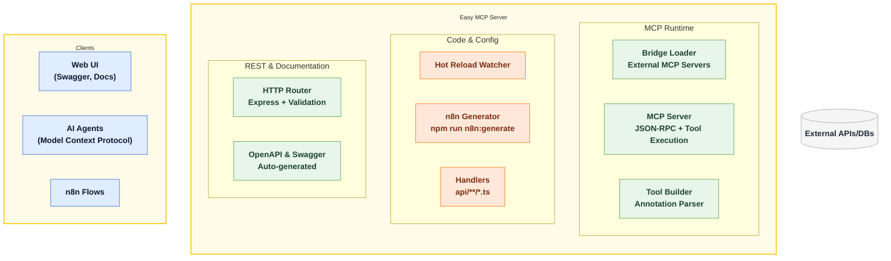
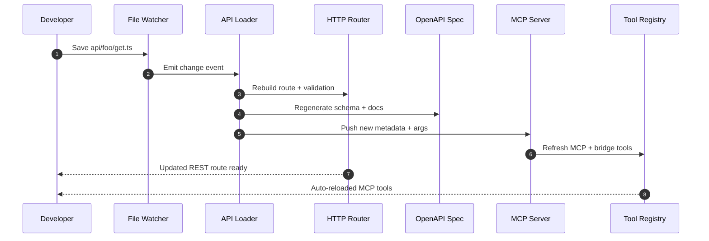
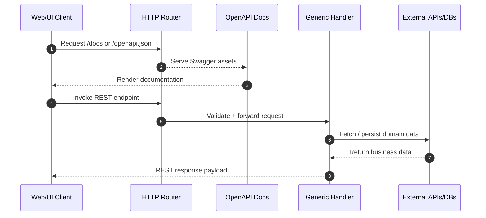
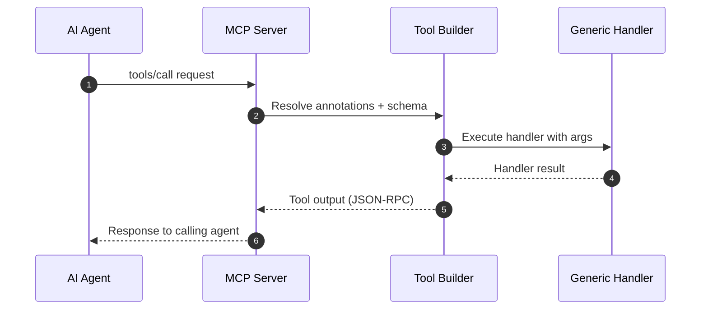
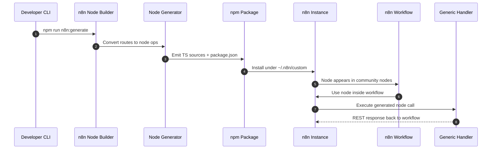

# System Architecture

Visual overview of how Easy MCP Server turns file-based handlers into REST APIs, MCP tools, and automations.

## Flows

Each diagram shows what happens after you add a handler under `api/`. Use them to trace hot reloads, REST calls, MCP tool executions, and generated n8n community nodes. The `Handler` participant represents the same generic handler shared across every interface.

### Hot Reload Flow

Tracks how a saved file propagates to new REST routes, OpenAPI docs, and MCP tool metadata without restarting the server.

### REST Flow

Reference request path for REST/HTTP consumers hitting the freshly generated endpoints.

### MCP Tool Flow

Details how an AI agent call travels through the MCP server, bridge/tool builder, and back out with JSON-RPC responses.

### n8n Community Node Flow

Illustrates generating a community node package, installing it into n8n, and using it inside workflows against your easy-mcp-server handlers.

