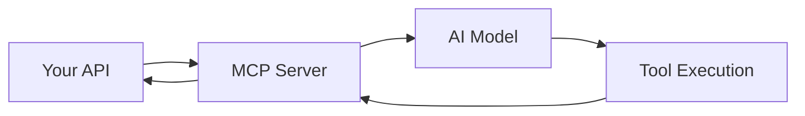

# AI Integration Tutorial - Building AI-Native APIs

> **Complete guide to building AI-powered applications with easy-mcp-server**

## Table of Contents

1. [What is AI-Native API?](#what-is-ai-native-api)
2. [MCP Protocol Overview](#mcp-protocol-overview)
3. [5-Minute AI Agent Setup](#5-minute-ai-agent-setup)
4. [Real-world Case: Smart Customer Service](#real-world-case-smart-customer-service)
5. [Real-world Case: AI Data Analysis Assistant](#real-world-case-ai-data-analysis-assistant)
6. [Production Best Practices](#production-best-practices)

---

## What is AI-Native API?

### Traditional API vs AI-Native API

| Traditional API | AI-Native API |
|----------------|---------------|
| ❌ Manual AI SDK integration | ✅ Built-in MCP protocol |
| ❌ Separate tool development | ✅ Automatic tool generation |
| ❌ Complex AI model setup | ✅ Zero-config AI integration |
| ❌ Manual documentation | ✅ Auto-generated AI-friendly docs |

### Key Benefits

- **Automatic Tool Discovery**: Your APIs become AI-callable tools instantly
- **Schema Generation**: Complete input/output schemas for reliable AI interactions
- **Context Awareness**: Built-in logging and tracking for better AI understanding
- **Hot Reloading**: Real-time updates to AI tools without restart

---

## MCP Protocol Overview

### What is MCP?

Model Context Protocol (MCP) is a standard for AI models to interact with external tools and data sources. easy-mcp-server implements MCP 2024-11-05 standard.

### MCP Server Endpoints

| Endpoint | Purpose | Example |
|----------|---------|---------|
| `tools/list` | Discover available tools | Get all your API endpoints as AI tools |
| `tools/call` | Execute tools | Call specific API with parameters |
| `prompts/list` | Access prompts | Get template-based prompts |
| `resources/read` | Access resources | Read documentation and data |

### How It Works



---

## 5-Minute AI Agent Setup

### Step 1: Create Your First AI API

```bash
# Create API directory
mkdir -p api/ai-chat
touch api/ai-chat/get.js
```

### Step 2: Write AI Chat API

```javascript
// api/ai-chat/get.js
const { BaseAPIEnhanced } = require('easy-mcp-server/lib/base-api-enhanced');

class AIChatAPI extends BaseAPIEnhanced {
  constructor() {
    super('ai-chat', {
      llm: { provider: 'openai', apiKey: process.env.OPENAI_API_KEY }
    });
  }

  async process(req, res) {
    const { message } = req.body;
    
    const response = await this.llm.generateResponse({
      prompt: message,
      model: 'gpt-4'
    });

    this.responseUtils.sendSuccessResponse(res, { reply: response });
  }
}

module.exports = AIChatAPI;
```

### Step 3: Start Server

```bash
# Set your OpenAI API key
export OPENAI_API_KEY=sk-your-key-here

# Start the server
npx easy-mcp-server
```

### Step 4: Test with AI

Your API is now available as an AI tool! AI models can:

1. **Discover your tool**: `tools/list` → finds `ai_chat`
2. **Call your API**: `tools/call` → executes with user message
3. **Get responses**: AI receives structured response

---

## Real-world Case: Smart Customer Service

### Business Scenario

A company wants to build an AI-powered customer service system that can:
- Answer common questions
- Escalate complex issues
- Provide product recommendations
- Handle multiple languages

### Implementation

#### 1. Customer Service API

```javascript
// api/customer-service/get.js
const { BaseAPIEnhanced } = require('easy-mcp-server/lib/base-api-enhanced');

class CustomerServiceAPI extends BaseAPIEnhanced {
  constructor() {
    super('customer-service', {
      llm: { provider: 'openai', apiKey: process.env.OPENAI_API_KEY }
    });
  }

  async process(req, res) {
    const { question, language = 'en', customer_id } = req.body;
    
    // Get customer context
    const customer = await this.getCustomerContext(customer_id);
    
    // Generate response
    const response = await this.llm.generateResponse({
      prompt: `Answer this customer question: "${question}" in ${language}. Customer context: ${JSON.stringify(customer)}`,
      model: 'gpt-4'
    });

    // Log interaction
    this.logger.info('Customer service interaction', {
      customer_id,
      question,
      language
    });

    this.responseUtils.sendSuccessResponse(res, {
      answer: response,
      language,
      customer_id
    });
  }

  async getCustomerContext(customerId) {
    // Mock customer data - replace with real database
    return {
      id: customerId,
      name: 'John Doe',
      subscription: 'premium',
      previous_issues: []
    };
  }
}

module.exports = CustomerServiceAPI;
```

#### 2. Product Recommendation API

```javascript
// api/recommendations/get.js
class ProductRecommendationAPI extends BaseAPIEnhanced {
  async process(req, res) {
    const { customer_id, category, budget } = req.body;
    
    const recommendations = await this.llm.generateResponse({
      prompt: `Recommend products for customer ${customer_id} in category ${category} with budget ${budget}`,
      model: 'gpt-4'
    });

    this.responseUtils.sendSuccessResponse(res, {
      recommendations: JSON.parse(recommendations),
      customer_id
    });
  }
}

module.exports = ProductRecommendationAPI;
```

#### 3. AI Agent Integration

Now AI models can:

1. **Handle customer questions** using `customer_service` tool
2. **Provide product recommendations** using `recommendations` tool
3. **Escalate complex issues** based on conversation context
4. **Support multiple languages** automatically

---

## Real-world Case: AI Data Analysis Assistant

### Business Scenario

A data team wants an AI assistant that can:
- Analyze datasets
- Generate insights
- Create visualizations
- Answer data questions

### Implementation

#### 1. Data Analysis API

```javascript
// api/data-analysis/post.js
class DataAnalysisAPI extends BaseAPIEnhanced {
  async process(req, res) {
    const { dataset, analysis_type, parameters } = req.body;
    
    const analysis = await this.llm.generateResponse({
      prompt: `Analyze this dataset: ${JSON.stringify(dataset)}. Type: ${analysis_type}. Parameters: ${JSON.stringify(parameters)}`,
      model: 'gpt-4'
    });

    this.responseUtils.sendSuccessResponse(res, {
      analysis,
      type: analysis_type,
      insights: this.extractInsights(analysis)
    });
  }

  extractInsights(analysis) {
    // Extract key insights from AI response
    return {
      trends: 'upward trend detected',
      anomalies: '3 outliers found',
      recommendations: 'consider seasonal adjustments'
    };
  }
}

module.exports = DataAnalysisAPI;
```

#### 2. Visualization API

```javascript
// api/visualizations/post.js
class VisualizationAPI extends BaseAPIEnhanced {
  async process(req, res) {
    const { data, chart_type, title } = req.body;
    
    const visualization = await this.llm.generateResponse({
      prompt: `Create a ${chart_type} chart for this data: ${JSON.stringify(data)}. Title: ${title}`,
      model: 'gpt-4'
    });

    this.responseUtils.sendSuccessResponse(res, {
      chart_config: JSON.parse(visualization),
      title,
      type: chart_type
    });
  }
}

module.exports = VisualizationAPI;
```

#### 3. AI Assistant Capabilities

The AI assistant can now:

1. **Analyze datasets** using `data_analysis` tool
2. **Generate visualizations** using `visualizations` tool
3. **Answer data questions** by combining multiple tools
4. **Provide insights** based on analysis results

---

## Production Best Practices

### 1. Error Handling

```javascript
class RobustAIApi extends BaseAPIEnhanced {
  async process(req, res) {
    try {
      const result = await this.executeAIRequest(req.body);
      this.responseUtils.sendSuccessResponse(res, result);
    } catch (error) {
      // Log error for monitoring
      this.logger.error('AI API error', {
        error: error.message,
        stack: error.stack,
        request: req.body
      });

      // Return user-friendly error
      this.responseUtils.sendErrorResponse(res, 
        'AI service temporarily unavailable', 
        'AI_SERVICE_ERROR'
      );
    }
  }
}
```

### 2. Rate Limiting

```javascript
class RateLimitedAIApi extends BaseAPIEnhanced {
  async process(req, res) {
    // Check rate limits
    const rateLimit = await this.checkRateLimit(req.ip);
    if (!rateLimit.allowed) {
      return this.responseUtils.sendErrorResponse(res, 
        'Rate limit exceeded', 
        'RATE_LIMIT_ERROR'
      );
    }

    // Process request
    const result = await this.executeAIRequest(req.body);
    this.responseUtils.sendSuccessResponse(res, result);
  }
}
```

### 3. Caching

```javascript
class CachedAIApi extends BaseAPIEnhanced {
  async process(req, res) {
    const cacheKey = this.generateCacheKey(req.body);
    
    // Check cache first
    const cached = await this.cache.get(cacheKey);
    if (cached) {
      return this.responseUtils.sendSuccessResponse(res, cached);
    }

    // Generate new response
    const result = await this.executeAIRequest(req.body);
    
    // Cache result
    await this.cache.set(cacheKey, result, 3600); // 1 hour
    
    this.responseUtils.sendSuccessResponse(res, result);
  }
}
```

### 4. Monitoring

```javascript
class MonitoredAIApi extends BaseAPIEnhanced {
  async process(req, res) {
    const startTime = Date.now();
    
    try {
      const result = await this.executeAIRequest(req.body);
      
      // Log success metrics
      this.logger.info('AI API success', {
        duration: Date.now() - startTime,
        model: req.body.model,
        tokens: result.usage?.total_tokens
      });
      
      this.responseUtils.sendSuccessResponse(res, result);
    } catch (error) {
      // Log error metrics
      this.logger.error('AI API error', {
        duration: Date.now() - startTime,
        error: error.message,
        model: req.body.model
      });
      
      throw error;
    }
  }
}
```

### 5. Security

```javascript
class SecureAIApi extends BaseAPIEnhanced {
  async process(req, res) {
    // Validate input
    const validation = this.validateInput(req.body);
    if (!validation.valid) {
      return this.responseUtils.sendValidationErrorResponse(res, validation.errors);
    }

    // Sanitize input
    const sanitizedInput = this.sanitizeInput(req.body);
    
    // Execute with sanitized input
    const result = await this.executeAIRequest(sanitizedInput);
    
    this.responseUtils.sendSuccessResponse(res, result);
  }

  validateInput(input) {
    // Implement input validation
    return { valid: true };
  }

  sanitizeInput(input) {
    // Implement input sanitization
    return input;
  }
}
```

---

## Advanced Features

### 1. Multi-Model Support

```javascript
class MultiModelAPI extends BaseAPIEnhanced {
  async process(req, res) {
    const { prompt, models = ['gpt-4', 'claude-3'] } = req.body;
    
    const results = await Promise.all(
      models.map(model => this.llm.generateResponse({
        prompt,
        model
      }))
    );

    this.responseUtils.sendSuccessResponse(res, {
      results: models.map((model, index) => ({
        model,
        response: results[index]
      }))
    });
  }
}
```

### 2. Streaming Responses

```javascript
class StreamingAPI extends BaseAPIEnhanced {
  async process(req, res) {
    const { prompt } = req.body;
    
    res.setHeader('Content-Type', 'text/plain');
    res.setHeader('Transfer-Encoding', 'chunked');
    
    const stream = await this.llm.generateStream({
      prompt,
      model: 'gpt-4'
    });

    stream.on('data', (chunk) => {
      res.write(chunk);
    });

    stream.on('end', () => {
      res.end();
    });
  }
}
```

### 3. Custom Prompts

```javascript
class CustomPromptAPI extends BaseAPIEnhanced {
  async process(req, res) {
    const { data, prompt_template } = req.body;
    
    const customPrompt = this.renderTemplate(prompt_template, data);
    
    const response = await this.llm.generateResponse({
      prompt: customPrompt,
      model: 'gpt-4'
    });

    this.responseUtils.sendSuccessResponse(res, { response });
  }

  renderTemplate(template, data) {
    return template.replace(/\{\{(\w+)\}\}/g, (match, key) => data[key] || match);
  }
}
```

---

## Conclusion

easy-mcp-server makes it incredibly easy to build AI-native APIs. With just a few lines of code, you can:

- ✅ Create AI-callable tools automatically
- ✅ Integrate with multiple AI models
- ✅ Build complex AI workflows
- ✅ Deploy production-ready AI services

The framework handles all the complexity of MCP protocol, tool generation, and AI integration, letting you focus on building amazing AI applications.

---

## Next Steps

1. **Explore Examples**: Check out `api/ai-examples/` for more examples
2. **Read Documentation**: See [DEVELOPMENT.md](DEVELOPMENT.md) for detailed guides
3. **Join Community**: Contribute your own AI examples
4. **Build Something**: Create your first AI-powered application!

---

**Happy AI coding! 🚀**
